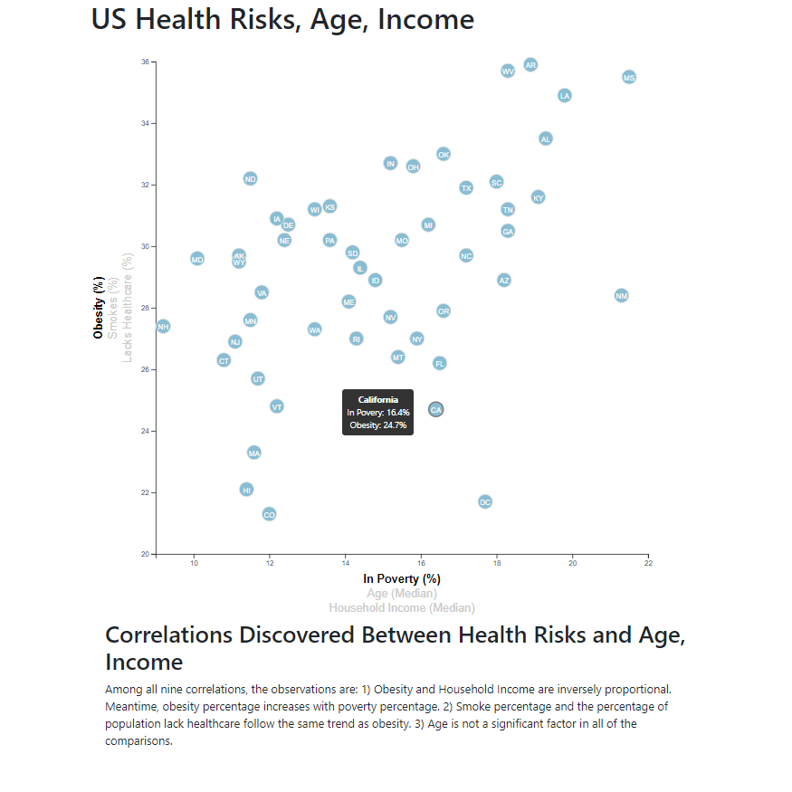

# Data Journalism and D3

### Background
This project is to analyze the current trends shaping people's lives and report it as a data journalism. I used JavaScript to create charts, graphs, and interactive elements to help readers understand the health risks facing particular demographics. I sifted through information from the U.S. Census Bureau and the Behavioral Risk Factor Surveillance System. The data set I used here is based on 2014 ACS 1-year estimates from the [US Census Bureau](https://data.census.gov/cedsci/). The current data set includes data on rates of income, obesity, poverty, etc., by state. MOE stands for "margin of error."

### D3 Scatter plot with multiple axises and tooltip

I created a scatter plot between two of the data variables, such as `Healthcare vs. Poverty` or `Smokers vs. Age`. From the screenshot below, in the scatter plot, each circle element represents each state with its abbreviations. Additional labels were combined in the scatter plot and give them click events so that users can decide which data to display. The transitions for the circles' locations as well as the range of the axes were animated. I also added tooltips to the circles and display each tooltip with the data that the user has selected. 

- - -

© 2021 Trilogy Education Services, LLC, a 2U, Inc. brand. Confidential and Proprietary. All Rights Reserved.
